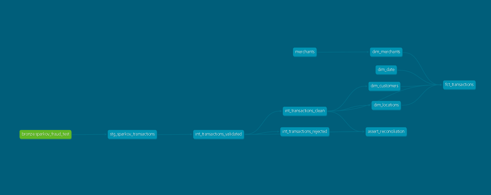

# Fintech Fraud Data Warehouse (dbt + PostgreSQL)

A dimensional data warehouse for credit-card fraud analytics, built on the [Sparkov](https://github.com/namebrandon/Sparkov_Data_Generation) simulated transaction dataset (~1.85M transactions). The project takes raw transaction data through a medallion architecture (bronze → silver → gold) and lands a Kimball star schema, with the entire transformation layer modelled, tested, and documented in **dbt**.

This is the dbt port of an earlier hand-written SQL build [ETL-Fintech-no-dbt](https://github.com/AbassLanre/ETL-Fintech-no-dbt). The port was an opportunity to fix two latent bugs, replace fragile patterns with better ones, and add a self-enforcing test layer the original never had.

---

## Overview

The warehouse answers fraud-analytics questions such as fraud rate by merchant, by customer demographic, by geography, by time, by transaction size, from a clean star schema. The pipeline ingests raw transactions and a merchant master, validates and quarantines bad rows, conforms the survivors into dimensions and a fact table with stable surrogate keys, and guards the whole thing with automated data tests.

**Tech stack:** dbt-core 1.11, dbt-postgres adapter 1.10, PostgreSQL, [dbt_utils](https://github.com/dbt-labs/dbt-utils), DBeaver (inspection).

---

## Architecture


<!-- Replace with your `dbt docs serve` lineage screenshot: save it as docs/lineage.png -->

The pipeline maps onto the medallion layers, each materialised deliberately:

| Layer | dbt location | Schema | Materialisation | Responsibility |
|---|---|---|---|---|
| Bronze | (loaded outside dbt) + `seeds/merchants.csv` | `bronze` | seed/raw | Raw Sparkov transactions; merchant master as a dbt seed |
| Staging | `models/staging/` | `silver` | view | Rename and cast only — no business logic. The contract against schema drift |
| Intermediate | `models/intermediate/` | `silver` | view → tables | Validation, quarantine, and cleansing |
| Marts | `models/marts/` | `gold` | table | Star schema: four dimensions + one fact |

**The intermediate layer is the heart of the design.** A single model, `int_transactions_validated`, computes a per-row verdict, one boolean flag per validation rule plus an overall `is_valid`, and **drops nothing**. Two downstream models fork off that verdict: `int_transactions_clean` (`where is_valid`, plus derived columns) and `int_transactions_rejected` (`where not is_valid`). Because both forks read the same verdict, clean + rejected reconciles to validated **by construction**, it is structurally impossible for the two to disagree.

**The marts layer** is a textbook star: `dim_customers`, `dim_merchants`, `dim_locations`, `dim_date`, and the `fct_transactions` fact. Every dimension carries a deterministic hash surrogate key; the fact carries the four foreign keys, a degenerate dimension (`trans_num`), and the measures.

---

## Key design decisions

This section is the main point of the project basically the *why* behind the build.

**Reconciliation by construction, not by hand.** The original SQL build proved clean + rejected = source by maintaining two queries with inverse `WHERE` clauses, fragile, because editing one filter and forgetting the other would silently break the reconciliation with no warning. The redesign computes one `is_valid` verdict and forks both outputs from it, so the invariant holds automatically and is additionally enforced by a test (see below). Reconciliation: **1,852,628 clean + 1,566 rejected = 1,854,194 validated.**

**Deterministic hash surrogate keys, not `row_number()`.** Generating surrogate keys with `row_number()` inside a view is a referential-integrity time bomb: the moment the row population changes, every key renumbers, and a fact row that pointed at customer key 5 now silently resolves to a *different* customer. No error, no null, just wrong data on a dashboard. Switching to `dbt_utils.generate_surrogate_key()` (a hash of the natural key) makes keys deterministic and stable across runs and materialisations, which kills that failure mode dead.

**An UNKNOWN sentinel built from a hashed literal.** Missing merchants need a place to land. Since surrogate keys are now hashes rather than integers, the old `-1` sentinel can't be a key directly — so the UNKNOWN member's key is `generate_surrogate_key(['-1'])`, and the fact uses the *identical* expression in its `COALESCE`. Same function, same literal, same hash, so unmatched fact rows land exactly on the UNKNOWN dimension row — and the `relationships` test proves it.

**Sentinel only where orphans are possible.** `dim_customers` and `dim_locations` are derived from the transactions themselves, so every key a fact references is guaranteed to exist — no orphans possible, no sentinel needed. `dim_merchants` is built from a *separate* seed, so a transaction can name a merchant the seed doesn't contain. The source of a dimension determines its orphan risk; only the externally-sourced dimension gets a sentinel.

**Tests as self-defence.** 18 generic tests (`unique` + `not_null` on every dimension key; `not_null` + `relationships` on every fact foreign key) plus a **singular reconciliation test** that fails if clean + rejected ever stops equalling validated. The `relationships` tests are the automated, every-run version of the FK integrity the original build only ever checked by eye. Tests turn silent failures into loud ones.

**Materialisation by purpose.** Staging and the validation model are views (cheap, no storage, recomputed on read). `clean`, `rejected`, and all marts are tables (queried repeatedly and joined against — cheap storage, expensive compute, so materialise). With deterministic keys, dimensions *could* now be views without corrupting FKs, but they stay tables for query performance.

**Two bugs fixed during the port.** The original derived day-of-week from the customer's date of birth rather than the transaction date, and computed customer age against `now()`, making it non-deterministic, changing on every run. The port derives both from `trans_date_trans_time` (age *at transaction time*), which is correct and idempotent.

---

## Data quality & findings

The raw Sparkov data is clean; ~1,800 dirty rows were deliberately injected against known business rules to exercise the validation layer. Of those, **1,566 (0.08% of 1.85M) were rejected** , and the number is fully reconstructable:

- **Out-of-range amounts** were dropped (rule: `0.01 ≤ amt ≤ 1,000,000`). Injected dirty amounts were random in the 100,000–9,999,999 range, so only those breaching 1,000,000 fail — roughly 44.
- **Nulls** in required fields (`trans_num`, transaction date, merchant, job) were dropped.
- **Duplicate `trans_num`** rows were de-duplicated (latest transaction kept).
- **Dirty categories** (e.g. `invalid`, `n/a`) were *not* dropped , they were standardised to `unknown`. Dirty but recoverable values are cleaned and untrustworthy values are rejected.

Having an *expected* reject magnitude is itself a control: if a future run quarantines 40,000 rows instead of ~1,600, something upstream has changed and the number rings the alarm.

---

## How to run

```bash
# 1. Clone and enter the project
git clone <repo-url> && cd fintech_dw

# 2. Create and activate a venv
python -m venv dbt-env
dbt-env\Scripts\activate        # Windows
# source dbt-env/bin/activate   # macOS/Linux

# 3. Install dbt + the Postgres adapter
pip install dbt-postgres

# 4. Configure your connection in ~/.dbt/profiles.yml (profile: fintech_dw)
#    pointing at a local PostgreSQL database

# 5. Install package dependencies (dbt_utils)
dbt deps

# 6. Load the merchant seed, build the models, run the tests
dbt seed
dbt run
dbt test

# 7. Generate and view the lineage docs
dbt docs generate
dbt docs serve --port 8081
```

A working `dbt debug` confirms the right connection

---

## What's next

- **Orchestration (v3):** schedule the build with Airflow — DAG, retries, alerting on test failures.
- **Containerisation (v4):** Docker Compose for Postgres + dbt so the project runs anywhere with one command.
- **Incremental & history:** convert the fact to an incremental model; add a dbt snapshot for Type-2 history on a slowly-changing dimension.
